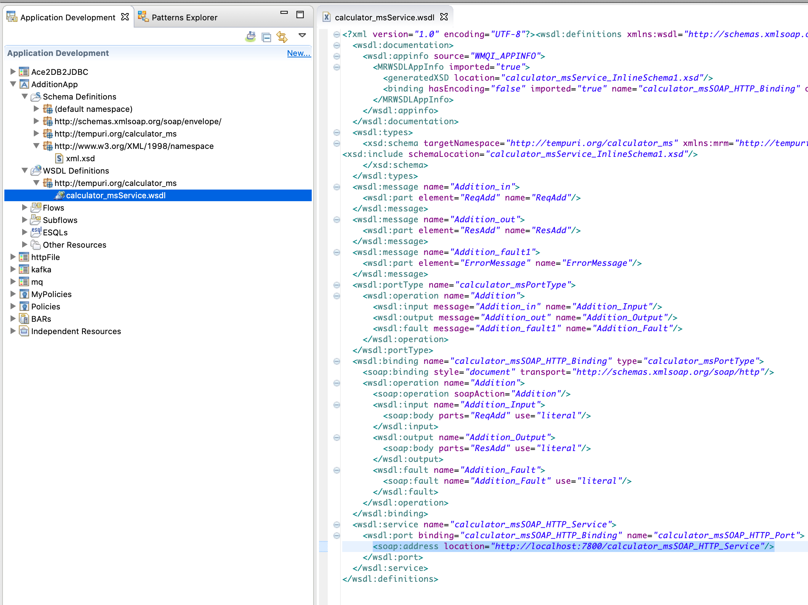
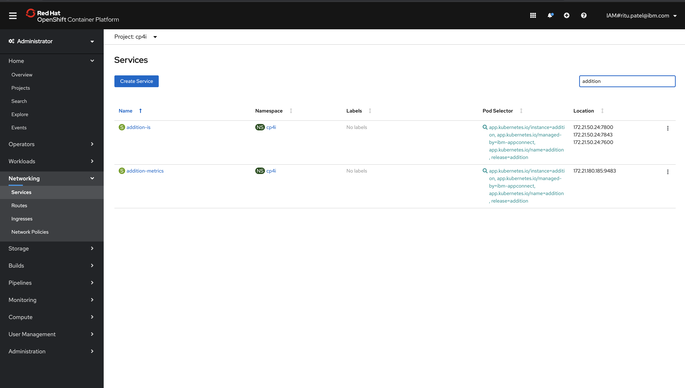
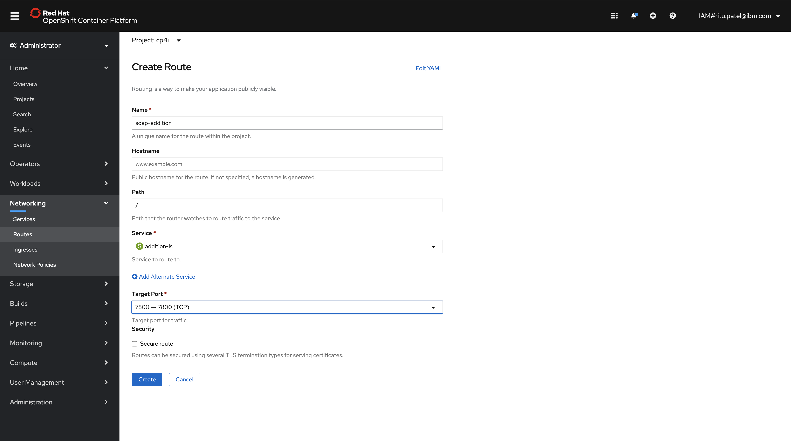
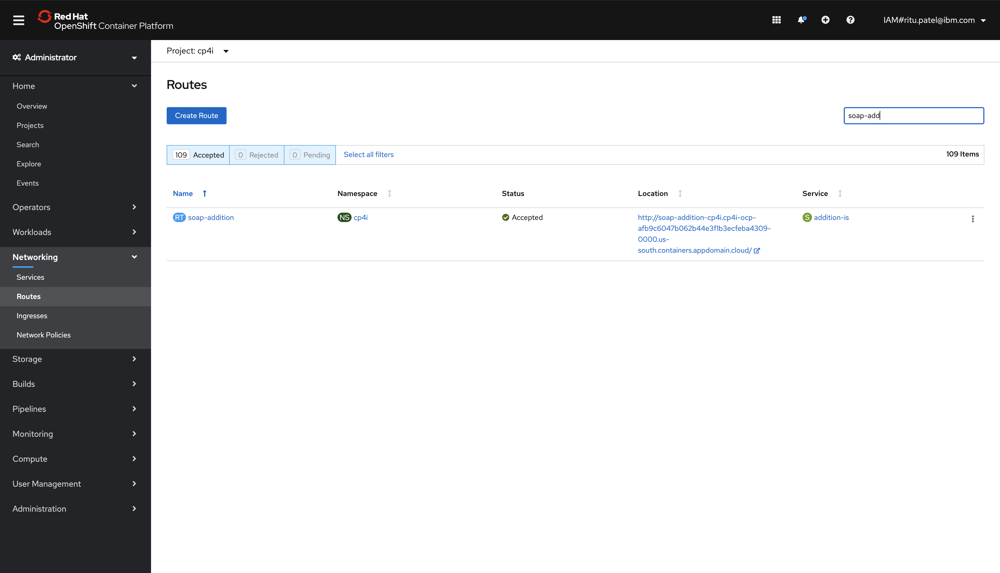
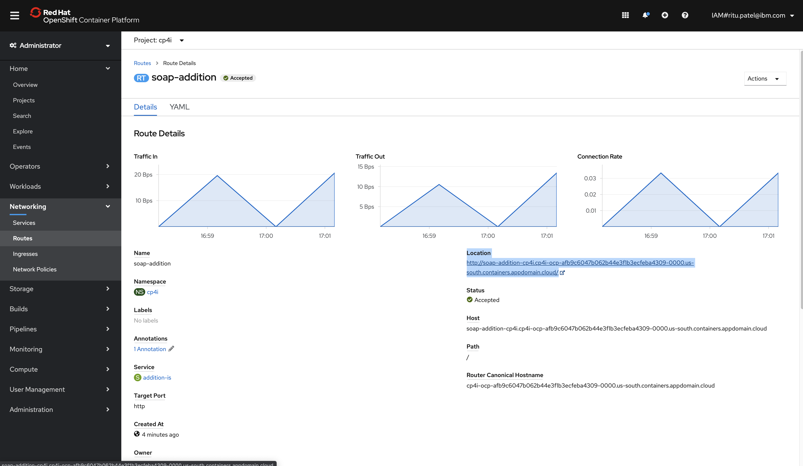

# This tutorial focuses on two usecases
## A. How to create a SOAP application
## B. How to create a route for HTTP nodes in OpenShift
 
 

## A. SOAP Application

 

## B. Create a route for HTTP nodes

### Step 1. You will need to know the port number and path where your SOAP application will be listening to. You can find it from your WSDL file. For example, in my soap application the soap:address is listening on port 7800 at path /calculator_msSOAP_HTTP_Service.

 

 

 

### Step 2. Once your integration server is uploaded on CloudPak for Integration, open your Openshift Console and see if service associated with your server name got created 

 

  

### Step 3. To find the service name, go to Networking -> Services on the left menu bar and search your server name. For example, the server I deployed in the previous step is called "addition" so I searched for addition under Services.  

 

 

### Step 4. After you check that service exist, go to Networking -> Routes and click on "Create Route"

 

 

 

### Step 5. Fill the required information

 

* Name: soap-addition (any-name)
* Hostname: leave it blank - openshift will create an endpoint for you
* Path: leave it blank - openshift will create an endpoint for you or customize it
* Service: Select the service name you found in Step 3
* Target port - Select the target port you found from your WSDL file
* Security - Optional to add security

Click Create

 

### Step 6. Open the route you just created

 

 

### Step 7. You will see the endpoint under "Location"

 

 

### Testing - Open SoapUI to test the endpoint. Make sure you use the Location under route and the path from Step 1. For example, in my case http://soap-addition-cp4i.cp4i-ocp-afb9c6047b062b44e3f1b3ecfeba4309-0000.us-south.containers.appdomain.cloud/calculator_msSOAP_HTTP_Service

 

 