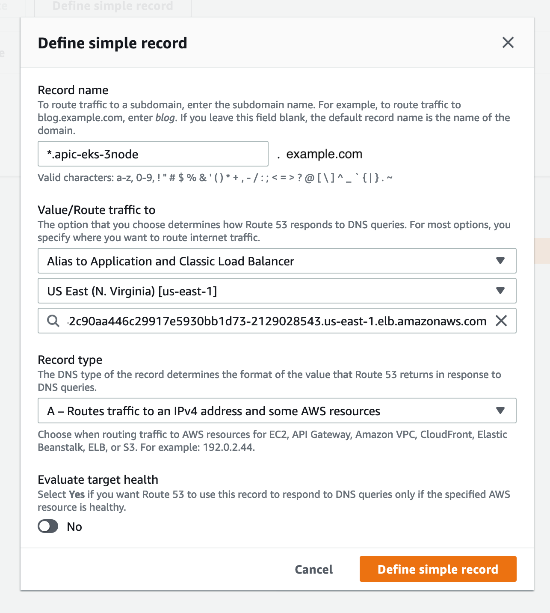

### Install APIC V10 on Amazon EKS

- [Install APIC V10 on Amazon EKS](#install-apic-v10-on-amazon-eks)
- [Summary](#summary)
- [Create EKS Cluster](#create-eks-cluster)
- [Download APIC Related CRDs](#download-apic-related-crds)
- [Install Ingress and Cert Manager](#install-ingress-and-cert-manager)
- [Configure Route53 DNS](#configure-route53-dns)
- [Apply CRDs and Customize APIC Subsystem Deployment](#apply-crds-and-customize-apic-subsystem-deployment)
- [Update Node vm.max_map_count](#update-node-vmmax_map_count)
- [Logging into a Cluster Node](#logging-into-a-cluster-node)
- [Cluster Access](#cluster-access)
- [Deleting Cluster](#deleting-cluster)
- [References](#references)

### Summary

This guide is a quick and consolidated reference on how to install APIC on EKS. This will create a cluster for the purposes of DEV and POC. The cluster sizing, profiles and licenses selected in the sample files are not meant to be used for a production cluster.

Always refere to the Knowledge Center for installation details: https://www.ibm.com/support/knowledgecenter/SSMNED_v10/com.ibm.apic.install.doc/tapic_install_Kubernetes.html

Assumptions:
  - Non-Prod license and sizing
  - Online install using IBM entitled registry (image mirror steps are not covered)

Prerequisites:
  - CLI
    - kubectl
    - eksctl
    - helm
    - aws (cli)
    - aws-iam-authenticator (cli)
  - General Access
    - IBM entitled container registry (ibm-entitlement-key)
    - IBM Fix Central (for APIC CRDs)
    - Route53 public hosted zone with domain for creating wildcard subdomain A record

### Create EKS Cluster

Using `eksctl` is the easiest way to spin up an EKS cluster. This command will create a cluster using node profile
`c5.4xlarge` of the following spec - CPU: 16, Memory: 32 Gib, Storage: EBS-Only, Network GBPs: Up to 10, EBS Mbs: 4,750.

Refer to `eksctl` doc for more information. https://eksctl.io/usage/creating-and-managing-clusters/

```
eksctl create cluster --name apic-eks --region us-east-1 --nodegroup-name apic-workers \
                      --node-type c5.4xlarge --nodes 2 --ssh-access \
                      --node-volume-size 120
```

### Download APIC Related CRDs

Follow directions from the Knowledge Center and download the needed files.

https://www.ibm.com/support/knowledgecenter/SSMNED_v10/com.ibm.apic.install.doc/tapic_install_Kubernetes_firststeps.html

For the purpose of this guide, some of the file samples are in this repo under directory `sample-files`. Other referenced files will be available in the `apiconnect-operator-release-files_v10.0.1.0.zip` (and within it the `helper_files.zip`) which can be downloaded from Fix Central.

### Install Ingress and Cert Manager

```
# Install Nginx ingress controller - ingress-config.yml
helm install ingress stable/nginx-ingress --values ./sample-files/ingress-config.yml --namespace kube-system

# Create namespace for APIC
kubectl create ns apic
kubectl config set-context --current --namespace=apic

# Install cert manager and ingress issuers
kubectl apply -f cert-manager-0.10.1.yaml
kubectl apply -f ingress-issuer-v1-alpha1.yaml -n apic

# Check the certs are created
kubectl get certificates -n apic
```

```
NAME                                     READY   SECRET                                   AGE
analytics-ca                             True    analytics-ca                             3h59m
analytics-client                         True    analytics-client                         3h59m
analytics-client-client                  True    analytics-client-client                  28h
analytics-default-ac-endpoint            True    analytics-default-ac-endpoint            3h59m
analytics-default-ai-endpoint            True    analytics-default-ai-endpoint            3h59m
analytics-ingestion-client               True    analytics-ingestion-client               28h
analytics-server                         True    analytics-server                         3h59m
api-endpoint                             True    api-endpoint                             28h
apicuser                                 True    management-db-client-apicuser            28h
apim-endpoint                            True    apim-endpoint                            28h
cm-endpoint                              True    cm-endpoint                              28h
consumer-endpoint                        True    consumer-endpoint                        28h
gateway-client-client                    True    gateway-client-client                    28h
gateway-endpoint                         True    gateway-endpoint                         28h
gateway-manager-endpoint                 True    gateway-manager-endpoint                 28h
gateway-peering                          True    gateway-peering                          28h
gateway-service                          True    gateway-service                          28h
ingress-ca                               True    ingress-ca                               28h
management-2a4f97b9-postgres             True    management-2a4f97b9-postgres             28h
management-2a4f97b9-postgres-pgbouncer   True    management-2a4f97b9-postgres-pgbouncer   28h
management-ca                            True    management-ca                            28h
management-client                        True    management-client                        28h
management-natscluster-mgmt              True    management-natscluster-mgmt              28h
management-server                        True    management-server                        28h
pgbouncer                                True    management-db-client-pgbouncer           28h
portal-admin                             True    portal-admin                             28h
portal-admin-client                      True    portal-admin-client                      28h
portal-ca                                True    portal-ca                                28h
portal-client                            True    portal-client                            28h
portal-server                            True    portal-server                            28h
portal-web                               True    portal-web                               28h
postgres                                 True    management-db-client-postgres            28h
postgres-operator                        True    pgo.tls                                  28h
replicator                               True    management-db-client-replicator          28h
```

You should see the ELB and its external IP created by AWS when you run the following:

```
$ kubectl get svc -n kube-system       
NAME                                    TYPE           CLUSTER-IP      EXTERNAL-IP                                                               PORT(S)                      AGE
ingress-nginx-ingress-controller        LoadBalancer   10.100.113.63   afba042c90aa446c29917e5930bb1d73-2129028543.us-east-1.elb.amazonaws.com   80:31751/TCP,443:30345/TCP   4d7h
ingress-nginx-ingress-default-backend   ClusterIP      10.100.167.4    <none>                                                                    80/TCP                       4d7h
kube-dns                                ClusterIP      10.100.0.10     <none>                                                                    53/UDP,53/TCP                4d8h
```

https://www.ibm.com/support/knowledgecenter/SSMNED_v10/com.ibm.apic.install.doc/tapic_install_K8s_ingress_ctl_reqs.html

https://www.ibm.com/support/knowledgecenter/SSMNED_v10/com.ibm.apic.install.doc/tapic_install_certmgr.html


### Configure Route53 DNS

Assuming the account has a Route53 public domain, we can create a wildcard subodmain record with name "`*.apic-eks-3node`" that points to the ELB created by the ingress controller above.  This will be the subdomain hostname that we'll configured for the hosts field in the CR customization in the yaml files.




### Apply CRDs and Customize APIC Subsystem Deployment

I've created custom CRs for the this guide. Please
modify the values in each CR that's being applied as needed.

NOTE: for the four files `*_cr.yaml` under `sample-files`, replace `$HOSTNAME` with the wildcard domain that we created above (e.g. `apic-eks-3node.example.com` for this example) 

Other files are available in the `apiconnect-operator-release-files_v10.0.1.0.zip` (and within it the `helper_files.zip`) which can be downloaded from Fix Central.

```
kubectl apply -f ibm-apiconnect-crds.yaml

# In this guide I'll be using the entitled registry, so
# we'll need a pull secret for the images
kubectl create secret docker-registry ibm-entitlement-key --docker-server=cp.icr.io \
        --docker-username=cp --docker-password=<ENTITLEMENT_KEY> -n apic


# Install Operators in APIC namespace, pointing to entitled registry and uses IBM entitlement key by default

kubectl apply -f ./sample-files/ibm-apiconnect.yaml
kubectl apply -f ./sample-files/ibm-datapower.yaml

# Edit CRs and apply them
kubectl apply -f ./sample-files/management_cr.yaml
kubectl apply -f ./sample-files/portal_cr.yaml
# Gateway
kubectl apply -f ./sample-files/dp-admin-secret.yaml
kubectl apply -f ./sample-files/apigateway_cr.yaml
kubectl apply -f ./sample-files/analytics_cr.yaml
```

After the deployment is complete, you should see something like the following when running `kubectl get pods`

```
$ kubectl get pods
NAME                                                              READY   STATUS      RESTARTS   AGE
analytics-cj-rollover-1603388700-hxlnt                            0/1     Completed   0          15m
analytics-client-cdfd8f94f-wjhmp                                  1/1     Running     0          4h11m
analytics-ingestion-b4459548d-5xcp6                               1/1     Running     0          4h11m
analytics-mtls-gw-695856497d-4dntr                                1/1     Running     0          4h10m
analytics-storage-coord-9f75d69d6-jrz7j                           1/1     Running     0          4h11m
analytics-storage-data-0                                          1/1     Running     0          4h11m
analytics-storage-master-0                                        1/1     Running     0          4h11m
backrest-backup-management-2a4f97b9-postgres-t2bt2                0/1     Completed   0          29h
datapower-operator-6856f485bb-fjntd                               1/1     Running     0          3h20m
datapower-operator-conversion-webhook-78bdbcdc59-2gpqk            1/1     Running     0          3h20m
gateway-0                                                         1/1     Running     0          29h
ibm-apiconnect-6579f568f-kvth2                                    1/1     Running     0          29h
management-2a4f97b9-postgres-757f467dff-4lzxx                     1/1     Running     0          29h
management-2a4f97b9-postgres-backrest-shared-repo-6ff9759dwgjvn   1/1     Running     0          29h
management-2a4f97b9-postgres-pgbouncer-7b6c7b7548-s6vc8           1/1     Running     0          29h
management-2a4f97b9-postgres-stanza-create-75r4d                  0/1     Completed   0          29h
management-analytics-proxy-5cfc5d9c87-5vwql                       1/1     Running     0          28h
management-apim-8676f6d79b-gg2nr                                  1/1     Running     0          28h
management-client-downloads-server-56464d597c-78sgz               1/1     Running     0          29h
management-juhu-cf497ff98-hbmrb                                   1/1     Running     0          28h
management-ldap-cf4fc7bc-mzp5c                                    1/1     Running     0          29h
management-lur-767c6b7b74-v9gjn                                   1/1     Running     0          28h
management-nats-operator-66b97844dd-gzhr6                         1/1     Running     0          29h
management-nats-streaming-operator-5d77b5fc66-4frj5               1/1     Running     0          29h
management-natscluster-1                                          1/1     Running     0          29h
management-portal-proxy-78884ddfc-fstjj                           1/1     Running     0          28h
management-stancluster-1                                          1/1     Running     0          29h
management-taskmanager-644dfd48b5-rmb8n                           1/1     Running     0          28h
management-ui-698dd4f45c-gz7qt                                    1/1     Running     0          29h
management-up-apim-data-populate-0-to-6-8055ab6f-wlv7g            0/1     Completed   0          29h
management-up-apim-schema-0-to-6-8055ab6f-q9bm6                   0/1     Completed   0          29h
management-up-lur-data-populate-0-to-2-8055ab6f-p4m8t             0/1     Completed   0          29h
management-up-lur-schema-0-to-2-8055ab6f-l895h                    0/1     Completed   0          29h
portal-5727ffec-db-0                                              2/2     Running     0          29h
portal-5727ffec-www-0                                             2/2     Running     0          29h
portal-nginx-675d6c6c69-g8xtm                                     1/1     Running     0          29h
postgres-operator-5b946c9c5-hk7lz                                 4/4     Running     0          29h
```

Then you should be able to see the ingress URLs from running `kubectl get ingress`

```
$ kubectl get ingress
NAME                      HOSTS                                   ADDRESS   PORTS     AGE
analytics-ac-endpoint     ac.apic-eks-3node.example.com           1.2.3.4   80, 443   4h50m
analytics-ai-endpoint     ai.apic-eks-3node.example.com           1.2.3.4   80, 443   4h50m
gateway-gateway           rgw.apic-eks-3node.example.com          1.2.3.4   80, 443   29h
gateway-gateway-manager   rgwd.apic-eks-3node.example.com         1.2.3.4   80, 443   29h
management-admin          admin.apic-eks-3node.example.com        1.2.3.4   80, 443   29h
management-api-manager    manager.apic-eks-3node.example.com      1.2.3.4   80, 443   29h
management-consumer-api   consumer.apic-eks-3node.example.com     1.2.3.4   80, 443   29h
management-platform-api   api.apic-eks-3node.example.com          1.2.3.4   80, 443   29h
portal-portal-director    api.portal.apic-eks-3node.example.com   1.2.3.4   80, 443   29h
portal-portal-web         portal.apic-eks-3node.example.com       1.2.3.4   80, 443   29h
```

Now we can navigate to the admin URL (e.g. `admin.apic-eks-3node.example.com`), and follow the Cloud Manager setup checklist.

https://www.ibm.com/support/knowledgecenter/SSMNED_v10/com.ibm.apic.cmc.doc/rapic_cmc_checklist.html


### Update Node vm.max_map_count

For the analytics pods to come up successfully, we have to set `vm.max_map_count` on each node. Here's a handy command to do that, assuming `ssh` was enabled when the cluster is spun up, allowing the user to log in with the default SSH key/pair.

```
# 7th field is the external IP of the nodes
kubectl get nodes -o wide --no-headers | awk '{print $7}' | xargs -I {} ssh-keyscan {} >> $HOME/.ssh/known_hosts
kubectl get nodes -o wide --no-headers | awk '{print $7}' | xargs -I {} ssh ec2-user@{} 'echo -e "\033[0;31m Setting {} \033[0m";sudo sysctl -w vm.max_map_count=262144; echo "vm.max_map_count=262144" | sudo tee -a /etc/sysctl.conf'
```


### Logging into a Cluster Node

Since we allowed SSH login from `eksctl create cluster` command, we
can login to the nodes and adjust node settings with `ec2-user`

```
# Get the public IPS for the node
kubectl get nodes -o wide

ssh ec2-user@54.196.40.41
```

### Cluster Access
```
$ aws configure --profile=clusterAdmin
AWS Access Key ID [None]: <access-key-id>
AWS Secret Access Key [None]: <access-key>
Default region name [None]: us-east-1
Default output format [None]: json
```

`export AWS_PROFILE=clusterAdmin`

List Clusters

`aws eks --region us-east-1 list-clusters`

Update kubeconfig with a different cluster

`aws eks --region us-east-1 update-kubeconfig --name apic-eks-3node`


### Deleting Cluster

Use the above commands to list out cluster names

`eksctl delete cluster --name <cluster-name>`

https://docs.aws.amazon.com/eks/latest/userguide/delete-cluster.html

### References

* Internal V10 EKS Install Guide
https://github.ibm.com/apiconnect-field/apicv10EKS

* AWS Instance Types
https://aws.amazon.com/ec2/instance-types/

* IBM API Connect V10 Knowledge Center - Kubernetes Install
https://www.ibm.com/support/knowledgecenter/SSMNED_v10/com.ibm.apic.install.doc/capic_planning_deployment_kubernetes.html

* Obtaining Install Files
https://www.ibm.com/support/knowledgecenter/SSMNED_v10/com.ibm.apic.install.doc/tapic_install_Kubernetes_firststeps.html

* Initial Configuration Checklist
https://www.ibm.com/support/knowledgecenter/SSMNED_v10/com.ibm.apic.cmc.doc/rapic_cmc_checklist.html

* Install eksctl
https://docs.aws.amazon.com/eks/latest/userguide/getting-started-eksctl.html#install-eksctl
https://docs.aws.amazon.com/eks/latest/userguide/create-cluster.html

* Install kubectl
https://kubernetes.io/docs/tasks/tools/install-kubectl/

* Install Helm
https://helm.sh/docs/intro/install/

* AWS CLI
https://docs.aws.amazon.com/cli/latest/userguide/install-cliv2.html

* AWS IAM
https://docs.aws.amazon.com/eks/latest/userguide/install-aws-iam-authenticator.html

